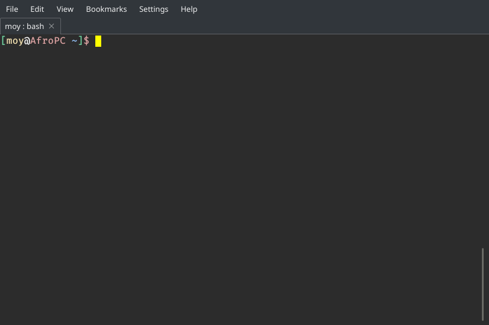

Linux
=====

En este curso se abordan puntos básicos sobre el manejo de un servidor basado en una imagen de Debian/Ubuntu mediante el uso de la terminal.

Requisitos previos
------------------
- Comoutadora (fisica o virtual) corriendo alguna distribución de GNU/Linux basada en Debian_.

Temario
-------
Familiarizándose con la terminal
________________________________
Lo primero que haremos será familiarizarnos con la terminal. Todo el manejo de los servidores lo haremos mediante esta interfaz.

Lo primero que debemos hacer es notar los elementos en pantalla. (Puede que nuestra terminal no sea idéntica, pero debe tener cierta similitud).

Elementos
.........
#. La parte amarilla que dice `moy` es el nombre de usuario con el que estamos trabajando actualmente (generalmente es el inicio de la cadena).
#. El `@` sirve para indicar que un usuario está dentro de alguna máquina (a su izquierda el usuario y a su derecha la máquina).
#. La parte roja que dice `AfroPC` indica el nombre de la máquina en la que estamos trabajando.
#. El símbolo `~` indica la ruta en la que estamos posicionados (Ese símbolo indica que estamos en la ruta `home` del usuario con el que estamos trabajando).
#. El símbolo `$` nos indica que la terminal está lista para recibir ordenes de un usuario no-root.

Navegando en el sistema
_______________________
Una vez que nos hemos familiarizado con la terminal podemos empezar a movernos por el sistema, para ello es necesario que utilicemos los siguientes comandos.

`pwd`
.....
Este comando nos indica en que ruta estamos trabajando.

.. code-block:: console

    [moy@AfroPC ~]$ pwd
    /home/moy

`ls`
....
Este comando nos muestra el contenido dentro de un directorio.

.. code-block:: console

    [moy@AfroPC ~]$ ls
    file1 file2 dir1  dir2

`mkdir`
.......
Con este comando creamos carpetas o directorios.

.. code-block:: console

    [moy@AfroPC ~]$ ls
    file1 file2 dir1  dir2
    [moy@AfroPC ~]$ mkdir dir3
    [moy@AfroPC ~]$ ls
    file1 file2 dir1  dir2  dir3

`touch`
.......
Con este comando podemos crear o actualizar la fecha de modificación de un archivo.

.. code-block:: console

    [moy@AfroPC ~]$ ls
    file1 file2 dir1  dir2  dir3
    [moy@AfroPC ~]$ touch file3
    [moy@AfroPC ~]$ ls
    file1 file2 file3 dir1  dir2  dir3

`cd`
....
Para cambiar de ruta en la que trabajamos usamos el comando `cd` (change directory).

.. code-block:: console

    [moy@AfroPC ~]$ pwd
    /home/moy
    [moy@AfroPC ~]$ cd dir1
    [moy@AfroPC ~]$ pwd
    /home/moy/dir1

`mv`
....
Este comando es utilizado para mover archivos o directorios dentro del sistema (también podemos renombrarlos)

.. code-block:: console

    [moy@AfroPC ~]$ ls
    file1 file2 file3 dir1  dir2  dir3
    [moy@AfroPC ~]$ mv file1 file_renamed
    [moy@AfroPC ~]$ ls
    file2 file3 file_renamed  dir1  dir2  dir3

`rm`
....
Para eliminar un archivo se utiliza el comando `rm`

.. code-block:: console

    [moy@AfroPC ~]$ ls
    file2 file3 file_renamed  dir1  dir2  dir3
    [moy@AfroPC ~]$ rm file_renamed
    [moy@AfroPC ~]$ ls
    file2 file3 dir1  dir2  dir3

Manejando archivos
__________________
Ya que sabemos como movernos y modificar archivos y ficheros como unidad, ahora veremos como manipular el contenido de los mismos.

Para lograr esto, comúnmente, se utiliza un editor de texto, es muy probable que su distribución venga con `vim` o `nano` como editor de textos en terminal.

`vim` o `nano`
..............
Con estos editores podemos ver y modificar el contenido de un archivo de texto.

.. code-block:: console

    [moy@AfroPC ~]$ ls
    file2 file3 file_renamed  dir1  dir2  dir3
    [moy@AfroPC ~]$ vim file2

.. code-block:: console

    Contenido del archivo <file2>

Nota: Para cerrar `vim` presiona `:q` seguido de `intro`. Para `nano` utiliza `c-x`.

`cat`
.....
Si solo queremos ver el contenido de un archivo (sin editarlo), este comando es muy útil.

.. code-block:: console

    [moy@AfroPC ~]$ cat file2
    Contenido del archivo <file2>

`tail`
......
Para obtener las ultimas lineas de un archivo (muy útil para ver los últimos eventos en un log) podemos usar este comando.

.. code-block:: console

    [moy@AfroPC ~]$ tail file2
    Contenido del archivo <file2>

Nota: Si pasamos el argumento `-f` a `tail`, obtenemos una versión "en vivo" del archivo, de tal modo que vemos los cambios en tiempo real.

`grep`
......
Este comando sirve para buscar cadenas dentro de archivos (también puede ser dentro de otras cadenas).

.. code-block:: console

    [moy@AfroPC ~]$ grep -r archivo
    file3:Contenido del archivo <file3>
    file2:Contenido del archivo <file2>

`find`
......
Con este podemos buscar archivos o directorios en base a su nombre. (Podemos usar regex).

.. code-block:: console

    [moy@AfroPC ~]$ find -name "*file*"
    ./file2
    ./file3
    ./dir1/file54

Permisos
________
Quizá nos hayamos topado con algún archivo o directorio al cual no hemos podido acceder, esto se debe al tema de los permisos dentro del sistema.
Cada archivo o directorio le pertenece a un usuario y a un grupo dentro del sistema. Además de esta relación posee atributos que indican lo que el propietario, el grupo al que pertenece y los demás usuarios son capaces de hacer con este objeto.

`ls -l`
.......
Para ver los permisos de un objeto podemos usar el comando `ls -l` el cual listará los archivos junto con información adicional (entre ella los temas de los permisos).

.. code-block:: console

    [moy@AfroPC ~]$ ls -l
    total 20
    drwxr-xr-x 2 moy  moy  4096 May 31 12:50 dir1
    drwx--x--x 2 root root 4096 May 31 13:02 dir2
    drwxr-xr-x 2 moy  moy  4096 May 31 12:50 dir3
    -rw-r--r-- 1 moy  moy    30 May 31 12:35 file2
    -rw-r--r-- 1 moy  moy    30 May 31 12:35 file3
    -rw-r--r-- 1 moy  moy     0 May 31 12:50 file_renamed

Explicación
^^^^^^^^^^^
#. El primer carácter indica la naturaleza del objeto (la `d` es de directorio).
#. Los siguientes 9 son 3 bloques de 3 elementos cada uno(`r` ead, `w` rite & e `x` ecute).
    #. A nivel de usuario (u)
    #. A nivel de grupo (g)
    #. A nivel global (o)
#. Las siguientes dos cadenas indican el usuario y el grupo al que pertenecen.

`sudo` o `su`
.............
Para poder modificar objetos a los que normalmente no tenemos acceso podemos usar el comando `sudo` para otorgarnos poderes de superusuraio de manera temporal o el comando `su` para cambiarnos al usuario `root` (Esto ultimo no es recomendable, pues se corre el riesgo de modificar archivos sin querer).

.. code-block:: console

    [moy@AfroPC ~]$ ls dir2
    ls: cannot open directory 'dir2': Permission denied
    [moy@AfroPC ~]$ sudo ls dir2
    [sudo] password for moy:
    file_secret

`chown`, `chgrp` y `chmod`
..........................
Estos comandos son utilizados para modificar los permisos de un objeto.
Con `chown` modificamos el propietario de un objeto, con `chgrp` el grupo al que pertenece y con `chmod` los permisos en sí.

.. code-block:: console

    [moy@AfroPC ~]$ ls -l
    total 20
    drwxr-xr-x 2 moy  moy  4096 May 31 12:50 dir1
    drwx--x--x 2 root root 4096 May 31 13:02 dir2
    drwxr-xr-x 2 moy  moy  4096 May 31 12:50 dir3
    -rw-r--r-- 1 moy  moy    30 May 31 12:35 file2
    -rw-r--r-- 1 moy  moy    30 May 31 12:35 file3
    -rw-r--r-- 1 moy  moy     0 May 31 12:50 file_renamed
    [moy@AfroPC ~]$ sudo chown moy dir2
    [moy@AfroPC ~]$ sudo chgrp moy dir2
    [moy@AfroPC ~]$ sudo chmod g+r,o+r dir2
    [moy@AfroPC ~]$ ls -l
    total 20
    drwxr-xr-x 2 moy moy 4096 May 31 12:50 dir1
    drwxr-xr-x 2 moy moy 4096 May 31 13:02 dir2
    drwxr-xr-x 2 moy moy 4096 May 31 12:50 dir3
    -rw-r--r-- 1 moy moy   30 May 31 12:35 file2
    -rw-r--r-- 1 moy moy   30 May 31 12:35 file3
    -rw-r--r-- 1 moy moy    0 May 31 12:50 file_renamed

Más poder
_________
Como es evidente, no podemos abarcar todos los temas y comandos de Linux en este curso, sin embargo este sistema nos ofrece la bondad de poder saber más acerca de sus herramientas sin salirnos del mismo.

`man`
.....
Con este comando podemos acceder a los `man` uales de los programas dentro del sistema, basta con ejecutar el comando `man APP` (donde `APP` es el programa   que queremos explorar) para que se nos despliegue la información relevante acerca de un programa.
*Nota:* Algunos programas no incluyen un manpages (paginas de manual), sin embargo podemos probar con el argumento `-h` o `--help` para obtener información adicional del mismo.

`whatis`
........
Con este comando podemos obtener una muy breve descripción de que es lo que hace un comando.

`apropos`
.........
Es común que no recordemos el nombre de algún comando que necesitemos, sin embargo con el comando `apropos`, si le pasamos texto plano como argumentos, podemos obtener una lista de comandos que tengan relación al texto que especificamos.

`whereis`
.........
En algunas ocasiones dará la necesidad de saber la ubicación del binario de un programa, para ello podemos usar el comando `whereis APP` (donde `APP` es el programa que buscamos) para saber la ruta en donde se encuentran los bianrios utilizados por el mismo.

Obtener nuevos programas
________________________
Las distribuciones diseñadas para ser usadas en servidores contiene muy pocos paquetes pre-instalados, es muy probable que debamos instalara más dependiendo de nuestras necesidades.

`apt-get`
.........
Los sistemas basados en Debian cuentan con este gestor de paquetes el cual permite instalar software adicional al sistema.

.. code-block:: console

    [moy@AfroPC ~]$ apt-get update # Esto actualiza los repositorios utilziados para obtener los programas

    [moy@AfroPC ~]$ apt-get upgrade # Actualiza los programas instalados a la versión mas reciente listada en los repositorios internos.
    [moy@AfroPC ~]$ apt-get install python3 # Con `install` instalamos los paquetes

Manejo de servidores
____________________
Lo que hemos visto aplica para sistemas Linux en general, sin embargo lo más deseado es que esto lo hagamos en un servidor dedicado y no en una computadora personal.

`ssh`
.....
Para conectarnos a una computadora remota utilizamos el comando `ssh USER@MACHINE` donde `USER` es el usuario dentro de la máquina remota con el cual queremos acceder y `MACHINE` es la dirección de la máquina (puede ser IP o su hostname)

.. code-block:: console

    [moy@AfroPC ~]$ ssh david@mi_server
    [david@mi_server]$

`crontab`
.........
Con este comando podemos automatizar la ejecución de tareas dentro del sistema. Con `crontab -e` abriremos nuestro editor de texto y podemos modificar el archivo para programar eventos periódicos.

`systemctl` o `service`
.......................
Con estos comandos (dependiendo de la distribución puede que no este uno o otro) podemos definir el comportamiento de  los demonios (así se llaman los servicios que corren en segundo plano) para realizar cosas como `stop`, `restart`, `start`, `status`.

`top`
.....
Para conocer que servicios y procesos están siendo ejecutados en el sistema podemos usar el comando `top` el cual nos desplegará una lista con los mismos. Un dato sumamente importante que se nos muestra es el `PID` (process ID).

`kill`
......
Si hay algún proceso que queramos terminar de manera instantánea (ojo, puede no activar ciertos mecanismos al momento de forzar el cierre), podemos usar el comando `kill PID`, donde `PID` es el `PID` del proceso a eliminar.

Maestro de la terminal
______________________
Por ultimo me gustaría compartir unos "trucos" para ser más eficiente a la hora de hacer uso de la terminal.

Ctrl-C
......
Con esta combinación de teclas podemos detener la mayoría de los programas que tengan una CLI (command line interface). En caso de que no funcioné prueba con `Ctrl-D`, esto envía una señal del `EOF` (end of file) lo cual suele ser indicador de que se debe terminar la ejecución.

Mouse 3
.......
Dentro de algunas terminales es posible pegar el texto seleccionado (desde cualquier lado) mediante el uso del botón 3 del ratón (generalmente el click de la rueda).

.. _Debian: https://www.debian.org/
